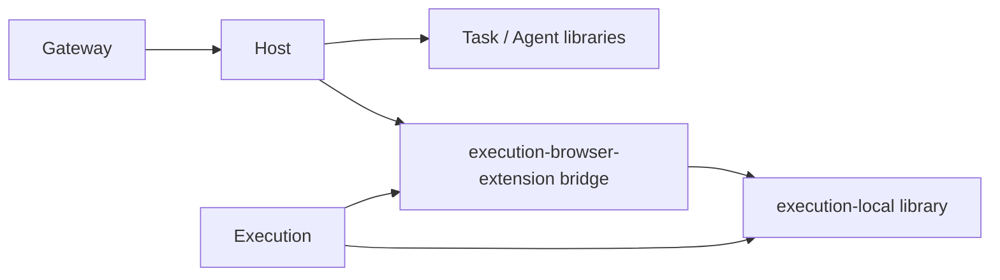

# `@tomflow/proflow-platform-host` Application Composition Root

## 1. Boundary

`platform-host` 是独立 npm package，但不是第六业务领域。它只负责：

```text
instantiate
Dependency Injection
local public transport/router
startup / shutdown
public client wiring
light health aggregation
```

禁止拥有：

```text
Task workflow facts
Role/Worker/Collaboration facts
Execution Effect/Result/Evidence/Approval
Model inference/assessment business facts
Deployment Module package/status/setup/docs truth
Browser tab/Conversation runtime state
Task/System Observer durable truth
```

## 2. Runtime Relationship

```text
Custom GPT
   ↓ Actions
agent-gateway
   ↓ local public transport
platform-host
   ├─ task-orchestration package
   ├─ agent-runtime package
   ├─ Tool Action application API / typed command router → Extension Local Tool lane
   ├─ Task Observer / Reconciliation application
   ├─ execution-runtime internal client（仅仍需 durable internal semantics）
   └─ model-runtime client（diagnostic/observer only）

Tool Action router 的物理目标：
             ↓
Browser Extension (separate install/runtime)
   ├─ Task UI / Approval-Alert UI
   ├─ System Observer（若仍部署于 Extension，必须独立于 progression lock）
   ├─ Background Carrier Controller
   └─ Local Tool Effect Gate
        ├─ Local Dev
        ├─ Repomix
        └─ CodeGraph
             ↓
          execution-local tool implementation
             ↓
          macOS 本机资源
```

> 注：上图 `agent-gateway` 为正式名称；若渲染工具不处理等宽箭头，语义仍以本文为准。

Execution Runtime、Model Runtime、Agent Gateway 是独立 service/process/deployment unit；Browser Extension 独立安装。platform-host 不把它们折成一个新 Monolith Domain。

## 3. Observer / Reconciliation Composition Boundary

Task Observer 的 deterministic decision 与“何时再次扫描”的 reconciliation 由 backend application 负责，platform-host 作为 composition root 装配它；它只读取 Owner current facts，并通过 typed Carrier request 驱动物理 WAKE/RESUME。事件、页面变化和 reconnect 只负责 kick，加上 bounded periodic catch-up 才构成最终发现保障。

platform-host 可以提供：

```text
Task drive projection client
Agent/Collaboration query client
Browser/Execution internal delivery/result query client
Model infer/health client（diagnostic only）
Browser Extension local-tool bridge client + operation-scoped readiness
```

但 host 不能：

```text
替 Worker complete/wait/fail/reopen
把 Tool result 自动映射成 Task transition
持久化 assessment as business truth
替 Browser 操作网页
让 System Observer reasoning 占用 progression single-flight/lock
```

## 4. Health

host 只聚合：

```text
process alive
local transport healthy
dependency availability
```

不得发明各 Domain READY。System Observer 若消费 host/dependency health，也只把其作为 bounded input。

## 5. Recovery

host restart：

```text
rebuild composition graph
→ re-open public clients
→ query owner current reality
```

不从 host cache/log 恢复业务事实，不 replay mutation。

## 6. TODO Discipline

Composition/wiring 只能在 Provider Public Contract 冻结后实施。host tests 证明 wiring/startup/shutdown/transport/health isolation，不替代领域行为、Browser Carrier 或 Observer assessment tests。

## 审计补充：启动图与 operation 依赖分开

启动依赖以 consumer → provider 表示：



保留其它不相关既有 descriptor 边；Gateway 的 public-ingress 仍按自身部署合同。图中不存在 Bridge → Host startup 边，也不存在 Host → Execution/Model 全局启动前置。Execution 调用 Host identity、Bridge UI 调用 Host application、Host 调用 Execution/Model 都属于特定 operation 的迟绑定依赖。setup 可先生成本模块 facts，后绑定 consumer config；不能因“等对方 READY 才发布自身 facts”形成冷启动环。

整体停止时先关闭依赖 Bridge 的客户端，再关闭 Bridge；单独 stop execution-runtime 不能触发 Bridge stop。已有 CLI buildDependencyGraph 可证明声明图 DAG，但不能发现 adapter 读 shared-facts 的隐藏反向依赖；验收必须从空配置/缺失 optional operation 服务启动实际 lifecycle。

Host GPT Tool route 禁止本机执行；Host 自身配置/credential/日志与 Task/Agent persistence 合法。判定以请求参数能否到达 executor 为准，不用 import node:fs 的关键词判定。

细则见 `EXECUTION-EXECUTION-BROWSER-EXTENSION-TECH-DESIGN` §23–24。

## 审计补充：消除 Agent 的间接启动环

目标 descriptor 还必须删除 `agent-runtime.requires: execution`；保留 `task-orchestration`。真实 Agent adapter 只创建 Role store，start/stop 为 library no-op；逻辑 Collaboration 接收 delivery evidence，不要求 Execution 服务参与初始化。ExecutionRef 作为消息投递证据字段不构成启动依赖。

否则新增 Execution → Extension 后会形成 `execution-runtime → execution-browser-extension → agent-runtime → execution-runtime` 环，也会让 Host/Task/Peer 间接依赖 Execution。Delivery 的请求期 durable Execution 依赖仍保留在 Carrier/composition，不删除消息 Evidence 语义。全量演算必须包含 Agent descriptor，不能只验证三个修改模块的子图。
